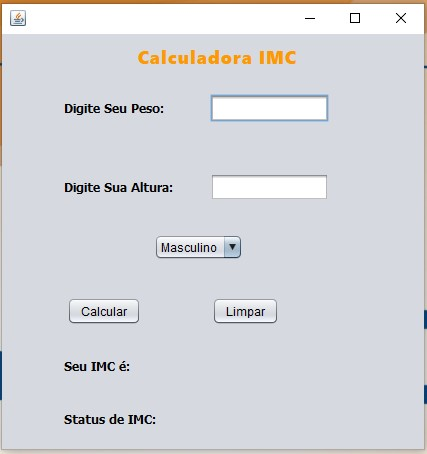
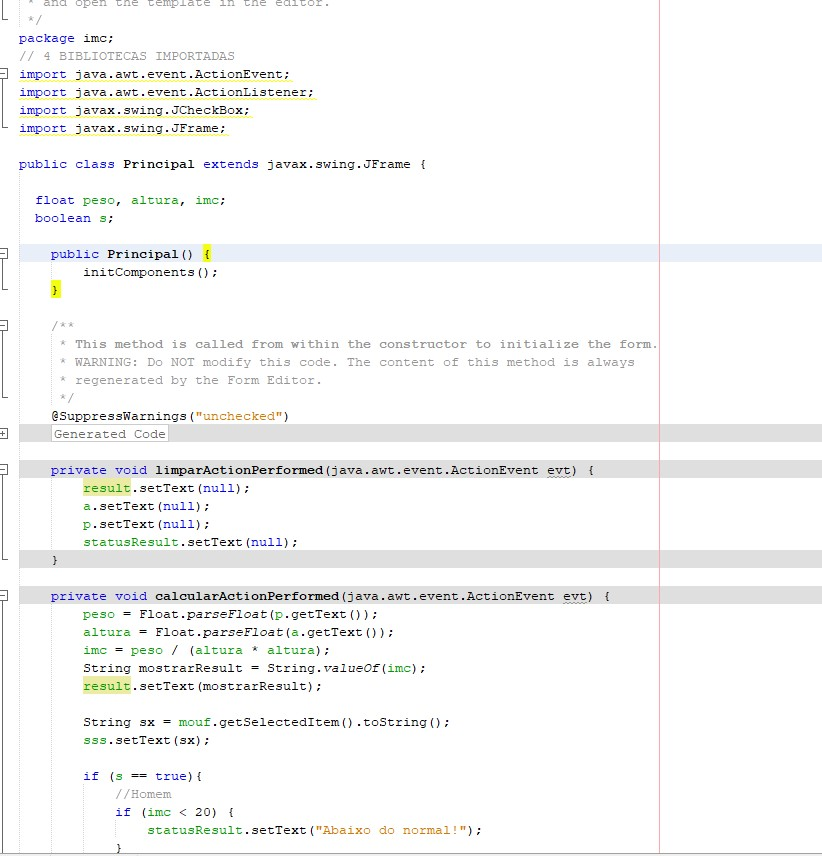

<h1>Calcular IMC - Java 🧮</h1>

<h2>Calcula o imc com base na altuta e peso da pessoa feita em JAVA e JFrame</h2>

<h2>Explicação:</h2>

Coloque seu peso e sua altura e vai ser falado se você está com o IMC alto, baixo ou normal.

<h2>💻Tecnologias</h2>

- JAVA 

- JFrame 

- GIT e GitHub 

<h2>📱Contato</h2>

viktorariel777@gmail.com

